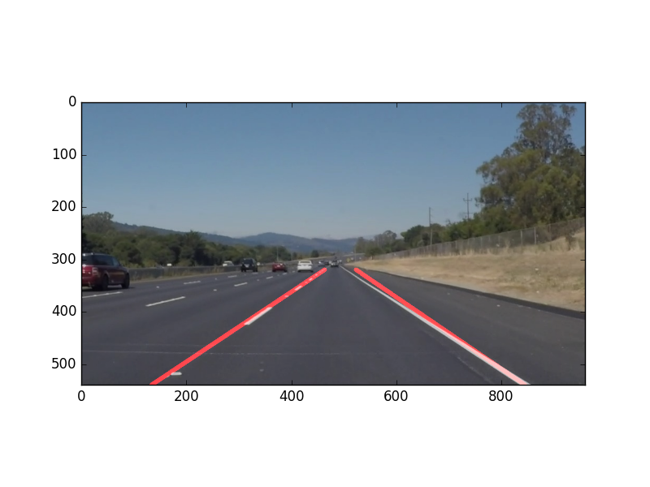

# Lane Detection

This project uses Canny Edge Detection, Hough Transforms, and linear regression to identify and mark lane lines on a road.

This repo was written with the hope that it would be easy to understand for someone not farmiliar with the project.




## How it works
We can describe this process in a straightforward way. 

- Detect the lane lines by looking at color contrast gradients in the image
- fit a curve to the points that make the line
- draw the red lines on top of the lane lines

This is an algorithm that uses Canny Edge detection hough transformations and polynomial regression to determine the the edges of lines in order to perform lane detection

There are a couple of algorithms to decide how to draw the lines, regression being the last thing I came up with. 


### Approach 1 - Simple Extremum

The first approach was to simply collect all the points in the lane, find the topmost left and rightmost points and graph lines between them. This worked somewhat well but it lacked the ability to "fill in" where there was an absence of lane markings.

```python
    # Line Extremum Approach
    right_lines = np.array(list(filter(lambda x: x[0] > (img.shape[1]/2), lines)))
    max_right_x, max_right_y = right_lines.max(axis=0)
    min_right_x, min_right_y = right_lines.min(axis=0)
```


### Approach 2 - Average Slope 

Another, more robust way that should work theorhetically would be to predict the x coordinates based on the average slope and solving for it with the average slope and average y and y intercept.

```python
    # Average slope Approach
    avg_right_slope = right_slopes.mean()

    # average point
    avg_right_point = np.mean(right_lines, axis=0)

    # y intercept of right line
    # b = y - mx
    right_y_intercept = avg_right_point[1] - avg_right_slope * avg_right_point[0]

    # Calculate x values based on average slope and y intercept
    max_right_x = int((min_right_y - right_y_intercept)/avg_right_slope)
    min_right_x = int((max_right_y - right_y_intercept)/avg_right_slope)
    
    r1 = (min_right_x, min_right_y)
    r2 = (max_right_x, img.shape[0]) # ground to bottom of image
```

This however would get thrown off by outliers returned by the Hough transform. 


### Approach 3 - Curve fitting

This felt like the most robust way to connect the dots by using numpy to generate a polynomial curve that modeled each lane, and the one that I'm using in my submission. I'm definitely the most happy with the results for this one becuase it allows us to generate sensible x values to complete the lanes when there are dashed lines in the road.

```python
    # Curve fitting approach
    # calculate polynomial fit for the points in right lane
    right_curve = np.poly1d(np.polyfit(right_lines[:,1], right_lines[:,0], 2))
    left_curve  = np.poly1d(np.polyfit(left_lines[:,1], left_lines[:,0], 2))

    # use new curve function f(y) to calculate x values
    max_right_x = int(right_curve(img.shape[0]))
    min_left_x = int(left_curve(img.shape[0]))
```

And with that our output lines are pretty good!


### Requirements 
- numpy
- matplotlib
- opencv
- python3 


Thank you to the Udacity mentors for the learning resources
